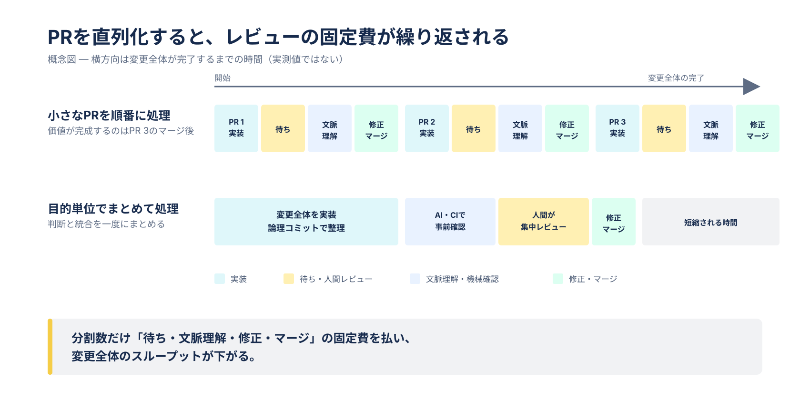

# AI時代のコードレビューを考え直す

Note: This is a point-in-time personal article. It was originally written as a private note in September 2026 and revised for this repository; it reflects personal operational preferences and is not an official recommendation of any organization. First published 2026-09-04 / last reviewed 2026-09-04.

Claims about AI and tooling — that implementation has become faster, that human review tends to become the relative bottleneck, what AI can check first, and what AI review can read — describe the situation as of the last reviewed date and are expected to change. The reasoning about pull requests, commits, and splitting criteria is intended to outlast them.

---

## 小さなPRを目的にしない

> **この文書で伝えたいこと**
>
> 目指すのは、PRを大きくすることでも小さくすることでもない。変更全体を、最小の待ち時間と文脈切り替えで、安全に理解・判断・統合できる形にすることである。

> 本稿は、すべてのチームに一律のPRサイズやレビュー手順を求めるものではない。
>
> AIによって実装速度が大きく上がった状況では、従来の開発フローをそのまま守ることが、かえって実装・レビュー・文脈理解のコストを増やす場合がある。本稿の目的は、変更に合ったレビュー方法を選べるようにする考え方を示すことである。

## 伝えたいこと

小さなPRは今も有効な手段である。しかし、常に小さくすること自体を目的にするべきではない。

従来は、変更を小さく分けることでレビューを早く、正確にしやすかった。現在も、互いに独立した変更や、単独で安全にマージ・リリース・ロールバックできる変更にはよく当てはまる。

一方、AIを使った開発では、実装に比べて人間のレビューが相対的なボトルネックになりやすい。ひとつの目的を持つ変更を機械的に複数のPRへ分けると、次の負担が増えることがある。

* PRごとに実装、レビュー、修正、再レビュー、承認、マージを繰り返す
* レビュワーが同じ背景や設計意図を何度も読み直す
* 後続PRが先行PRに依存し、レビューやマージを直列化する
* 先行PRの修正により、承認済みの後続PRでも前提確認や再レビューが必要になる
* リベース、コンフリクト解消、CI、動作確認などの統合作業を繰り返す
* 本来ひとまとまりの振る舞いがPR間に分散し、全体として正しいか判断しにくくなる

この場合、PRを小さくすることで1回のレビューは軽く見えても、変更全体のコストと所要時間は増えている。

本稿が問題にするのは、小さな変更単位そのものではない。互いに独立してリリース・検証できる小さなバッチは、フィードバックとリスク低減のために引き続き有効である。問題になるのは、強く依存する変更を形式的に複数のPRへ分け、レビューとマージを直列化する場合である。

_次の図は、依存する小さなPRを直列に処理した場合の概念図であり、レビューに伴う固定費が繰り返される様子を示している。Stacked PR（先行PRのブランチの上に後続PRを積み、先行のマージを待たずにレビューを進める方式）や並列レビューのように、マージを待たずに次の実装やレビューを進められる場合は、この前提には当てはまらない。_



## PRの大きさだけで判断しない

変更量は認知負荷やレビュー時間に影響する重要なシグナルである。大きな変更ほど、レビューの精度、変更の理解、マージ、ロールバックは難しくなる。ただし、それだけで分割の要否を決めることはできない。

変更行数とあわせて判断したいのは、次の問いである。

* 変更の目的と設計を説明できるか
* レビュワーが判断すべき点を特定できるか
* コミットを順に追えば、変更の組み立てを理解できるか
* 自動テストや静的解析によって機械的に確認できる部分が明確か
* リスクの高い箇所と、その確認方法が明確か
* 変更全体として動作を検証できるか

これらを満たすなら、変更行数が多くてもレビュー可能なPRになり得る。反対に、変更行数が少なくても、目的や影響範囲が不明ならレビューしにくい。

## PRとコミットは役割が異なる

* **PR**は、ひとつの目的を持つ変更について、全体として妥当かを判断し、統合する単位である。
* **コミット**は、変更を意味のある順序で読み、意図を理解し、履歴として残す単位である。

PRを無理に分割しなくても、コミットを適切な粒度に保つことで、レビュワーは変更を段階的に追える。コミットの粒度や品質は、引き続き重要である。

たとえば、次のようにコミットを分けられる。

1. データ構造やインターフェースを追加する
2. ドメインロジックを実装する
3. 呼び出し側を切り替える
4. テストを追加・更新する
5. 不要になった旧実装を削除する

各コミットは、可能な範囲で意図がひとつにまとまり、レビューできる状態にする。試行錯誤の痕跡をそのまま並べるのではなく、レビュー前に読みやすい履歴へ整える。ただし、動作する各段階を無理に独立PRとしてマージできる形へ変換する必要はない。

## 分割するかどうかの判断

| 分割が有効になりやすい | ひとつのPRが有効になりやすい |
| --- | --- |
| それぞれが独立して価値を持つ | 全体が揃って初めて目的を達成する |
| 単独で安全にマージ、リリース、ロールバックできる | 後続変更が先行変更へ強く依存する |
| 担当者やレビュワーが明確に異なる | 同じ設計判断と文脈を共有する |
| 変更ごとにリスク境界を分けられる | 分割すると一時的な互換コードや重複が増える |
| 後続PRが先行PRのレビュー結果に影響されにくい | 先行PRの修正が後続PRへ連鎖する |
| 個別に検証しても意味がある | 統合した状態でなければ十分に検証できない |

PRの分割は、変更行数の上限ではなく、依存関係、リスク、検証可能性、レビュー担当の境界を基準に決める。

## 作業を始める前に共有する

コンフリクトが起きそうな変更、共通基盤へ影響する変更、他者の作業方針を変え得る変更は、影響を受ける関係者やレビュワーへ実装前に概要を共有し、必要なら方針を決めておく。これはAIの利用有無にかかわらない従来からの基本であり、大きな手戻りを避けるために引き続き重要である。

大きい、またはリスクの高い変更で必要なのは、必ずしもPRの機械的な分割ではない。実装前の設計確認、Draft PR（レビュー依頼前の作業中PRを共有し、方向性への意見をもらう使い方）、短時間の打ち合わせ、ペアレビューなどで早期に方向性を確認する方が有効な場合もある。

## 人間とAIのレビュー対象を分ける

AIが広い範囲の機械的な確認を担えるようになっても、人間の判断が不要になるわけではない。人間の時間は、仕様、設計、リスク、利用者への影響、運用上の妥当性など、文脈を必要とする判断へ重点的に使う。

### AIで一次確認しやすい観点

* 明らかな不具合、考慮漏れ、例外処理
* 命名や一貫性、重複、不要な複雑さ
* テスト不足や境界値の候補
* セキュリティ、性能、並行実行に関する典型的な問題の洗い出し
* 変更と既存コード、テスト、ドキュメントの不整合

これらはAIだけで完結させてよい範囲という意味ではない。特にセキュリティ、性能、並行実行は影響が大きく、AIの指摘を一次情報として扱いながら、テスト、静的解析、人間の確認を組み合わせる。

### 人間が重点的に判断すること

* その変更を行うべきか
* 要求や利用者の期待に合っているか
* 設計上のトレードオフを受け入れられるか
* 失敗時の影響と運用方法が妥当か
* 将来の変更や保守に対して適切か
* AIや自動テストでは確認できない前提が正しいか

AIのレビュー結果は補助情報であり、正しさを保証するものではない。指摘の採否も含め、最終的な判断と説明責任は人間が持つ。

## PR本文をレビューの入口にする

PR本文は単なる変更要約ではなく、レビューを案内するためのインターフェースにする。

冒頭には**人間レビュー用の短いセクション**を置く。レビュワーがそこを読めば、変更の目的、判断してほしい点、見る場所、確認方法が分かり、すぐにレビューを始められる状態を目指す。

その後に**詳細なコンテキスト**を置く。人間向けの要点を長い説明で埋めないため、必要に応じて折りたたむ。利用するAIレビューツールがPR本文を参照できる場合はその入力になり、参照できない場合でも、背景を詳しく確認したい人間や、将来PRを調査する人には役立つ。

作成者は、AIが生成した説明をそのまま信用せず、実際の変更と一致していることを確認する。レビュー中に実装が変わった場合は、本文も更新する。

## PR本文のテンプレート

```markdown
## 変更の目的

<!-- 何を、なぜ変えるのか。2〜4行で書く -->

## 人間にレビューしてほしいこと

### 判断してほしいこと

- [ ] この設計上のトレードオフを採用してよいか
- [ ] この仕様・利用者への影響を許容できるか

### 確認してほしい箇所

- `path/to/file.rb` の `ClassName#method`
  - 観点: 競合時の扱いが要件に合っているか
- `path/to/component.vue`
  - 観点: エラー時の表示と再操作の流れが自然か

### 確認方法・証跡

- 自動テスト: `bin/rails test ...`
- 手動確認: <!-- 手順またはスクリーンショット -->
- CI: <!-- 結果へのリンク -->

### 既知の制約・対象外

- 今回扱わないこと:
- 受け入れているリスク:

<details>
<summary>AIレビュー用コンテキスト</summary>

### ゴール

### 非ゴール

### 前提・制約・守るべき不変条件

### 変更の全体像

<!-- 主要ファイルと役割、データや処理の流れ -->

### 受け入れ条件

- [ ]

### 実行した検証と結果

### 特に探索してほしいリスク

- 正しさ:
- セキュリティ:
- 性能:
- 並行実行・データ整合性:
- 後方互換性:

### 関連資料

</details>
```

すべての欄を毎回埋める必要はない。変更に関係しない欄は削除し、重要な判断が埋もれない長さに保つ。コミットを順に追ってほしい場合だけ、レビュー順序を追記する。

## ワークフローの例

以下は、ここまでの考え方を実際の流れに落とした一例である。決まった手順として守るものではなく、チームや変更の性質に合わせて組み替えることを前提にしている。

1. 作成者は、実装前に共有が必要な変更かを判断する。
2. 実装中は、意味のある単位でコミットを作る。
3. PR作成前に、テスト、静的解析、AIレビューなどで機械的に発見できる問題を減らす。
4. PR本文に、人間へ求める判断とAI向けコンテキストを書く。
5. 人間はPR本文からレビューを開始し、重要な設計・仕様・リスクを優先して確認する。
6. 修正後は、変更した範囲と再確認してほしい点を明示する。必要に応じてAIに差分を再レビューさせる。
7. 変更全体がコードベースを改善し、残るリスクを受け入れられるならマージする。

## 誤解しないために

「小さなPRを強制しない」は、巨大な変更を無条件に許容するという意味ではない。

* 説明できない変更をまとめてよいわけではない
* レビュワーが判断できない状態で承認を求めてよいわけではない
* テストや検証をAIレビューで置き換えてよいわけではない
* 高リスクな変更ほど、早い段階で設計や検証方法を共有する
* 必要ならPRの分割以外にも、担当別レビュー、ペアレビュー、段階的リリース、Feature Flag（未完成または高リスクな経路を実行時の切り替えで無効にしたままマージする仕組み）などを使う

目指すのは、PRを大きくすることでも小さくすることでもない。変更全体を、最小の待ち時間と文脈切り替えで、安全に理解・判断・統合できる形にすることである。

## 参考資料

* [Small CLs — Google Engineering Practices](https://google.github.io/eng-practices/review/developer/small-cls.html) — 小さな変更がレビュー速度や正確性に有利だとする従来の原則（同ドキュメントの CL はGoogle社内の変更単位を指し、本稿のPRにおおむね対応する）
* [Working in small batches — DORA](https://dora.dev/capabilities/working-in-small-batches/) — 独立して価値を持ち、テスト可能な単位へ分ける小さなバッチの有効性
* [The Standard of Code Review — Google Engineering Practices](https://google.github.io/eng-practices/review/reviewer/standard.html) — 完璧さではなく、変更全体がコードの健全性を改善するかを判断する考え方
* [AI が記述したコードは誰がレビューするのか？ — Google Cloud](https://cloud.google.com/transform/ja/when-ai-writes-the-code-who-reviews-it-cto-google-cloud) — AI駆動開発でボトルネックが実装からレビューへ移るという問題提起（一般法則を示す研究ではなく、実務上の事例）
* [Use GitHub Copilot code review across the pull request lifecycle — GitHub Docs](https://docs.github.com/en/copilot/tutorials/use-copilot-code-review-across-the-pull-request-lifecycle) — AIレビューを先に行い、人間の時間を設計やプロダクトへの影響に使うワークフロー（2026-09-04 時点の同製品の説明）
* [About GitHub Copilot code review — GitHub Docs](https://docs.github.com/copilot/concepts/agents/code-review) — AIレビューは誤る可能性があり、人間のレビューで補う必要があるという注意（2026-09-04 時点の同製品の説明）

参照日: 2026-09-04。リンク先の内容はその後変更または削除される場合がある。
